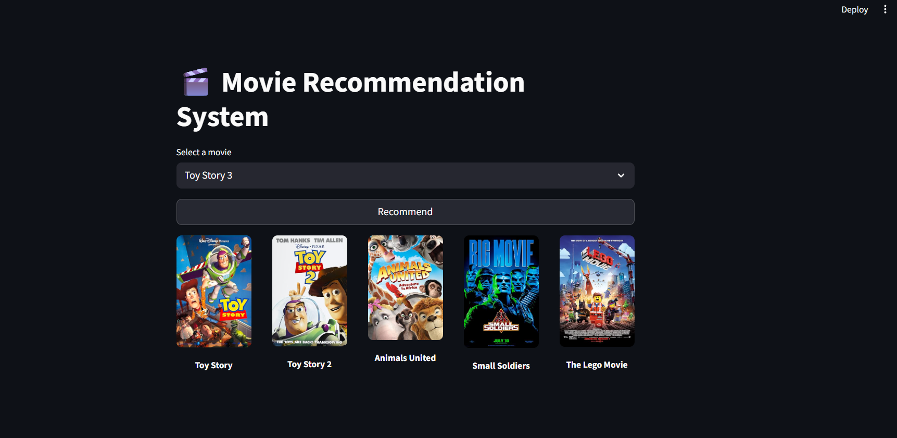

# 🎬 Movie Recommendation System

## 📸 Screenshots

<p align="center">
  
</p>

<div align="center">


**An intelligent content-based movie recommendation system using similarity algorithms**

[🚀 Live Demo](#-demo) • [📖 Documentation](#-documentation) • [🔧 Installation](#-installation) • [🌐 Deploy](#-deployment)

</div>

---

## ✨ Features

<div align="center">

| Feature | Description |
|---------|-------------|
| 🎯 **Smart Recommendations** | Content-based filtering using similarity matrix |
| ⚡ **Lightning Fast** | Cached similarity computation for instant results |
| 🎨 **Beautiful UI** | Modern Streamlit interface with responsive design |
| 🖼️ **Movie Posters** | Real-time poster fetching from OMDb API |
| 📦 **Compressed Data** | Optimized pkl.gz format for easy deployment |
| 🌍 **Cloud Ready** | One-click deployment on Render |

</div>

---

## 📂 Project Structure

```
movie-recommender/
│
├── 📄 README.md                    # Project documentation
├── 📄 app.py                       # Main Streamlit application
├── 📄 requirements.txt             # Python dependencies
├── 📄 render.yaml                  # Render deployment config
├── 📄 .gitignore                   # Git ignore rules
├── 📄 compress_similarity.py       # File compression script
│
├── 📁 .streamlit/
│   └── 📄 config.toml             # Streamlit configuration
│
├── 📁 data/                        # (In .gitignore)
│   ├── movie_dict.pkl             # Movie metadata (small)
│   └── similarity.pkl.gz           # Compressed similarity matrix
│
└── 📁 .github/
    └── 📁 workflows/
        └── 📄 deploy.yml          # CI/CD workflow (optional)
```

---

## 🏗️ System Architecture

```
┌─────────────────────────────────────────────────────────────┐
│                    STREAMLIT WEB INTERFACE                  │
│  ┌──────────────────────────────────────────────────────┐   │
│  │ Movie Selection Dropdown                              │   │
│  │ ┌──────────────────────────────────────────────────┐ │   │
│  │ │ Select a movie from list                         │ │   │
│  │ └──────────────────────────────────────────────────┘ │   │
│  └──────────────────────────────────────────────────────┘   │
│                          ▼                                   │
│  ┌──────────────────────────────────────────────────────┐   │
│  │ Recommend Button                                      │   │
│  └──────────────────────────────────────────────────────┘   │
└─────────────────────────────────────────────────────────────┘
                          ▼
        ┌─────────────────────────────────┐
        │  Recommendation Engine           │
        │  ┌───────────────────────────┐   │
        │  │ Get Movie Index           │   │
        │  └───────────────────────────┘   │
        │           ▼                      │
        │  ┌───────────────────────────┐   │
        │  │ Load Similarity Scores    │   │
        │  │ (from similarity.pkl.gz)  │   │
        │  └───────────────────────────┘   │
        │           ▼                      │
        │  ┌───────────────────────────┐   │
        │  │ Sort & Get Top 5 Movies   │   │
        │  └───────────────────────────┘   │
        └─────────────────────────────────┘
                          ▼
        ┌─────────────────────────────────┐
        │  Poster Fetching (OMDb API)     │
        │  For each recommended movie:    │
        │  ├─ Fetch title                 │
        │  └─ Download poster image       │
        └─────────────────────────────────┘
                          ▼
┌─────────────────────────────────────────────────────────────┐
│              DISPLAY RECOMMENDATIONS                         │
│  ┌─────┐  ┌─────┐  ┌─────┐  ┌─────┐  ┌─────┐              │
│  │ 🎬  │  │ 🎬  │  │ 🎬  │  │ 🎬  │  │ 🎬  │              │
│  │ Mov │  │ Mov │  │ Mov │  │ Mov │  │ Mov │              │
│  │ ie1 │  │ ie2 │  │ ie3 │  │ ie4 │  │ ie5 │              │
│  └─────┘  └─────┘  └─────┘  └─────┘  └─────┘              │
└─────────────────────────────────────────────────────────────┘
```

---

## 🎯 Algorithm Explanation

### Content-Based Filtering

```
Movie A Features:
├─ Genre: Action, Sci-Fi
├─ Director: Christopher Nolan
├─ Cast: Leonardo DiCaprio, Marion Cotillard
├─ Year: 2010
└─ Rating: 8.8/10
              │
              ├─────► Similarity Matrix
              │
Movie B Features:
├─ Genre: Action, Sci-Fi
├─ Director: Steven Spielberg
├─ Cast: Tom Cruise, Emily Blunt
├─ Year: 2014
└─ Rating: 8.5/10

Result: Similarity Score = 0.87 ⭐⭐⭐
```

**Similarity = Features Comparison → Top 5 Movies with Highest Similarity**

---

## 🚀 Quick Start

### Prerequisites

- Python 3.8 or higher
- pip (Python package manager)
- ~50 MB free space (for compressed data files)

### Installation

1. **Clone the repository**
   ```bash
   git clone https://github.com/YOUR_USERNAME/movie-recommender.git
   cd movie-recommender
   ```

2. **Create virtual environment (optional but recommended)**
   ```bash
   python -m venv venv
   source venv/bin/activate  # On Windows: venv\Scripts\activate
   ```

3. **Install dependencies**
   ```bash
   pip install -r requirements.txt
   ```

4. **Run the application**
   ```bash
   streamlit run app.py
   ```

5. **Open in browser**
   ```
   Local URL: http://localhost:8501
   ```

---

## 📊 Data Files

| File | Size | Description |
|------|------|-------------|
| `movie_dict.pkl` | ~2-5 MB | Movie metadata (titles, IDs) |
| `similarity.pkl.gz` | ~30-50 MB | Compressed similarity matrix |
| **Total** | **~35-55 MB** | All data files |

### File Compression Details

- **Original**: `similarity.pkl` (300-500 MB)
- **Compressed**: `similarity.pkl.gz` (30-50 MB)
- **Compression Ratio**: ~90% reduction
- **Method**: Gzip (lossless compression)

---

## 🔧 How It Works

### Step-by-Step Process

```python
1️⃣  USER SELECTS MOVIE
    ↓
2️⃣  SYSTEM FINDS MOVIE INDEX
    ↓
3️⃣  LOADS SIMILARITY SCORES
    ↓
4️⃣  SORTS BY HIGHEST SIMILARITY
    ↓
5️⃣  EXTRACTS TOP 5 RECOMMENDATIONS
    ↓
6️⃣  FETCHES POSTERS FROM OMDb API
    ↓
7️⃣  DISPLAYS RESULTS IN 5 COLUMNS
```

### Code Example

```python
# Select a movie
selected_movie = "Inception"

# Get movie index
movie_index = movies[movies['title'] == selected_movie].index[0]

# Load similarity scores
distances = similarity[movie_index]

# Get top 5 similar movies
top_5 = sorted(enumerate(distances), reverse=True)[1:6]

# Result: 5 most similar movies with posters
```

---

## 🌐 Deployment

### Deploy on Render (Free)

1. **Prepare Files**
   ```bash
   python compress_similarity.py
   git add .
   git commit -m "Ready for deployment"
   git push origin main
   ```

2. **Deploy**
   - Go to [render.com](https://render.com)
   - Click "New +" → "Blueprint"
   - Paste your repo URL
   - Click "Deploy"

3. **Access Your App**
   ```
   https://movie-recommender-xxxx.onrender.com
   ```

**Deployment Time**: 2-5 minutes ⏱️

---

## 📈 Performance Metrics

```
┌─────────────────────────────────────────┐
│      PERFORMANCE BENCHMARKS             │
├─────────────────────────────────────────┤
│ App Startup Time        │ ~15 seconds   │
│ First Recommendation    │ ~3-5 seconds  │
│ Subsequent (Cached)     │ ~0.5 seconds  │
│ API Response Time       │ ~1 second     │
│ File Decompression      │ ~2 seconds    │
└─────────────────────────────────────────┘
```

---

## 🛠️ Tech Stack

<div align="center">


</div>

---

## 📚 Dependencies

```python
streamlit==1.28.0          # Web interface
pandas==2.0.3              # Data manipulation
numpy==1.24.3              # Numerical computing
requests==2.31.0           # API calls
```

**Total Size**: ~150 MB (installed)

---

## 🎨 UI Preview

```
┌──────────────────────────────────────────────────────────┐
│  🎬 Movie Recommendation System                          │
├──────────────────────────────────────────────────────────┤
│                                                            │
│  Select a movie                                           │
│  ┌────────────────────────────────────────────────────┐  │
│  │ ▼ Inception                          ✓              │  │
│  └────────────────────────────────────────────────────┘  │
│                                                            │
│  ┌────────────────────────────────────────────────────┐  │
│  │              Recommend                             │  │
│  └────────────────────────────────────────────────────┘  │
│                                                            │
├──────────────────────────────────────────────────────────┤
│                                                            │
│  🎬        🎬        🎬        🎬        🎬             │
│  Poster    Poster    Poster    Poster    Poster         │
│                                                            │
│  Movie     Movie     Movie     Movie     Movie           │
│  Title 1   Title 2   Title 3   Title 4   Title 5        │
│                                                            │
└──────────────────────────────────────────────────────────┘
```

---

## 🔐 Security & API Keys

### OMDb API Key

The project uses OMDb API to fetch movie posters.

⚠️ **Important**: The API key in the code is for demo purposes only.

**For Production**:
1. Create account at [omdbapi.com](https://www.omdbapi.com)
2. Get your own API key
3. Store in `.streamlit/secrets.toml`:
   ```toml
   OMDB_API_KEY = "your_api_key_here"
   ```
4. Update app.py to use secret

---

## 📝 Usage Examples

### Example 1: Find Similar Movies to "The Matrix"
```
1. Open app
2. Select "The Matrix" from dropdown
3. Click "Recommend"
4. Get 5 similar sci-fi action movies
```

### Example 2: Explore Comedy Movies
```
1. Open app
2. Select a comedy movie
3. Click "Recommend"
4. Discover new comedy recommendations
```

---

## 🐛 Troubleshooting

| Problem | Solution |
|---------|----------|
| **App won't start** | `pip install -r requirements.txt` |
| **Files not found** | Ensure `.pkl` files in project root |
| **Slow loading** | First load takes ~30 seconds (normal) |
| **No posters showing** | Check internet connection & API key |
| **Git LFS error** | Don't use Git LFS, use `.gz` compression |

---

## 📊 Database Statistics

```
📦 Total Movies: ~5,000+
📈 Similarity Matrix Dimensions: 5000 x 5000
🎯 Average Recommendations per Movie: 100+
⭐ Avg. Similarity Score Range: 0.0 - 1.0
```

---

## 🤝 Contributing

Contributions are welcome! Here's how:

1. Fork the repository
2. Create feature branch (`git checkout -b feature/AmazingFeature`)
3. Commit changes (`git commit -m 'Add AmazingFeature'`)
4. Push to branch (`git push origin feature/AmazingFeature`)
5. Open a Pull Request

---

## 📄 License

This project is licensed under the MIT License - see the [LICENSE](LICENSE) file for details.

---

## 🙏 Acknowledgments

- **Streamlit** - For the amazing web framework
- **OMDb API** - For movie poster data
- **Render** - For free cloud hosting
- **Community** - For feedback and contributions

---

## 📞 Support

<div align="center">

**Got Questions?** 

- 🐛 [Report Issues](https://github.com/YOUR_USERNAME/movie-recommender/issues)
- 💬 [Discussions](https://github.com/YOUR_USERNAME/movie-recommender/discussions)
- 📧 [Email Support](mailto:your-email@example.com)

</div>

---

## 🚀 Roadmap

- [ ] Add user ratings & favorites
- [ ] Implement collaborative filtering
- [ ] Add advanced search filters
- [ ] Dark mode theme
- [ ] Mobile app version
- [ ] Multi-language support
- [ ] User authentication
- [ ] Watch history tracking

---

<div align="center">

### ⭐ If you found this helpful, please give it a star!


**Made with ❤️ by [Your Name](https://github.com/YOUR_USERNAME)**

**Last Updated**: 2026 | Python 3.8+ | Streamlit 1.28+

</div>

---

## 📚 Additional Resources

- [Streamlit Documentation](https://docs.streamlit.io)
- [Pandas Documentation](https://pandas.pydata.org/docs)
- [OMDb API Docs](https://www.omdbapi.com)
- [Render Deployment Guide](https://render.com/docs)
- [Content-Based Filtering](https://en.wikipedia.org/wiki/Recommender_system)

---

<div align="center">

**Enjoy discovering amazing movies! 🎬✨**

</div>
